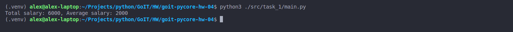
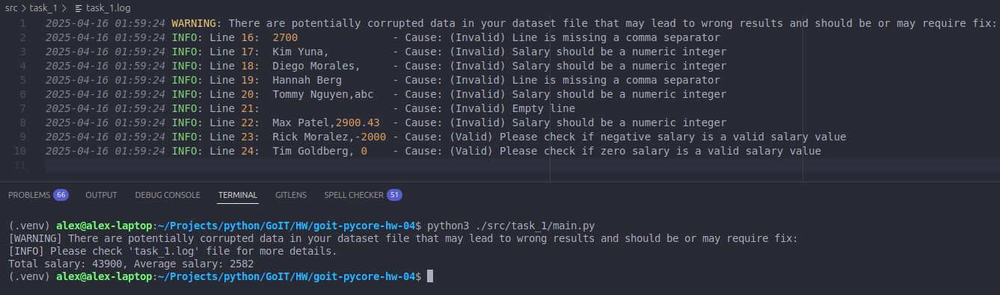
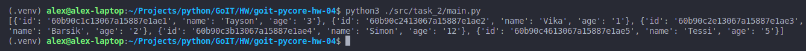
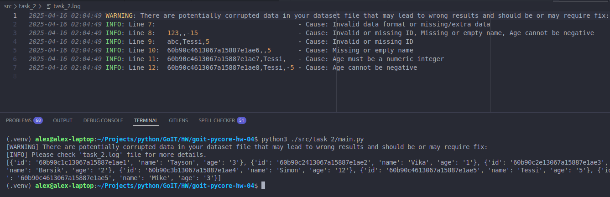
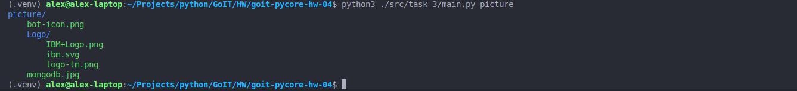
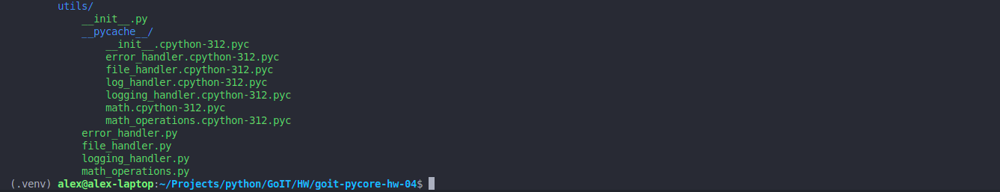
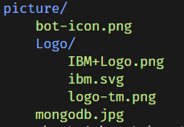
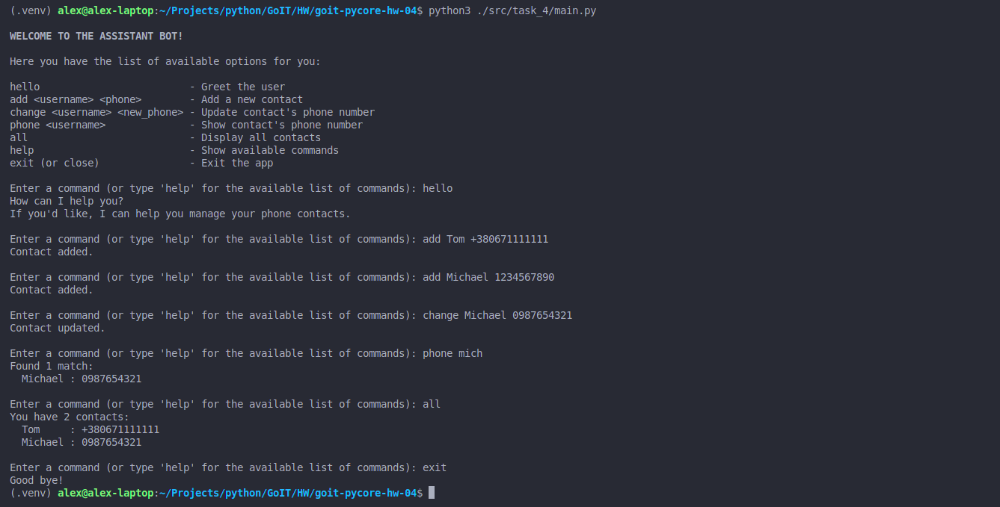

# Python Programming: Foundations and Best Practices 2.0

### [# goit-pycore-hw-04](https://github.com/topics/goit-pycore-hw-04)

<p align="center">
  
</p>


## Working with files and a modular system

This assignment consists of 4 parts in total, each specified separately and has a link to the solution file.

### Project Setup and Run Instructions

#### Prerequisites

Before starting, ensure that you have the following installed:

* Python 3.7+ (Make sure python and pip are available in your terminal)
* Git (optional, for version control)

#### Setting Up the Development Environment

**1. Clone the Repository**

If you haven't cloned the project yet, you can do so using:

```bash
git clone https://github.com/oleksandr-romashko/goit-pycore-hw-04.git
cd goit-pycore-hw-04
```

or download zip archive with code directly [from the repository](https://github.com/oleksandr-romashko/goit-pycore-hw-04/archive/refs/heads/main.zip).

**2. Create a Virtual Environment**

**Linux/macOS (using `bash` or `zsh`):**

Run the setup.sh script:

```bash
source setup.sh
```

This will:
* Create a virtual environment (`.venv`).
* Activate the virtual environment.
* Install dependencies listed in `requirements.txt`.
* Set the `PYTHONPATH` for module imports.

**Windows (using Command Prompt):**

If you're using Command Prompt to set up your development environment, you can run the `setup.bat` script:

```cmd
setup.bat
```
This will:
* Create a virtual environment (.venv).
* Activate the virtual environment.
* Install dependencies listed in requirements.txt.
* Set the `PYTHONPATH` for module imports.

#### Running the Project
Once your virtual environment is set up, you can run the task scripts.

**1. Running the Tasks in VS Code**

Once the virtual environment is activated and `PYTHONPATH` is set, you can run each of the task files directly from VS Code. Make sure that your `settings.json` (in `.vscode` folder) is correctly set up, as discussed previously.

VS Code will automatically use the virtual environment and set the correct `PYTHONPATH` if you've configured your settings properly.

**2. Running the Tasks from the Command Line**

After setting up your virtual environment and setting the `PYTHONPATH`, you can run the tasks directly from the terminal.

Each of these commands will run the corresponding task script (please note, that for Linux/macOS you might use `python3` instead of `python` command):

Run task 1:

```bash
python src/task_1/main.py
```

Run task 2:

```bash
python src/task_2/main.py
```

Run task 3:

```bash
python src/task_3/main.py path/to/directory
```

```bash
python src/task_3/main.py path/to/directory --tree
```

Run task 4:

```bash
python src/task_4/main.py
```

```bash
python src/task_4/main.py --alternative
```

**Alternatively, you can use a script to run the tasks** (apply respective task number to run respective task script):

* **On Linux/macOS (shell script)**:

  Run task 1 with the script:
  ```bash
  ./src/task_1/run_task_1.sh
  ```

  Make sure the shell scripts have execution permission by running:

  ```bash
  chmod +x src/task_1/run_task_1.sh
  ```

* **On Windows (batch script)**:

  ```cmd
  src\task_1\run_task_1.bat
  ```

<details>

<summary>Assignment 1 - Calculate salary from data in a file</summary>

#### Solution:

Solution for this task is located in the following files:
* [./src/task_1/main.py](./src/task_1/main.py) - main entry point file.
* [./src/task_1/salary_calculator.py](./src/task_1/salary_calculator.py) - file with main business logic.

Result screenshot - file with no issues:

<p align="center">
  
</p>

Result screenshot - file with issues:

<p align="center">
  
</p>
.

#### Task description:

There is a text file containing information about the monthly salaries of developers in your company.
Each line in the file includes a developer's full name and their salary, separated by a comma (with no spaces).

Example:
```
Alex Korp,3000  
Nikita Borisenko,2000  
Sitarama Raju,1000
```

The task is to write a function called `total_salary(path)` that analyzes this file and returns the total and average salary of all developers.

#### Task requirements:

1. The function `total_salary(path)` must accept a single argument — the path to the text file.
2. The file contains salary data separated by commas. Each line represents one developer.
3. The function should:
   1. Analyze the file
   2. Calculate the total salary
   3. Calculate the average salary
4. The function must return a tuple of two numbers: total salary and average salary.


#### Recommendations to the implementation:

1. Use a context manager `with` to read the file.
2. Don't forget to set the encoding when opening the file.
3. Use the `split(',')` method to separate the name and salary in each line.
4. Compute the total sum of all salaries, then divide it by the number of developers to get the average.
5. Handle possible exceptions, such as the file not existing.

#### Evaluation criteria:

1. The function must correctly calculate the total and average salaries.
2. It should handle cases where the file is missing or invalid.
3. The code should be clean, well-structured, and easy to understand.

#### Example:

Function usage:

```python
total, average = total_salary("path/to/salary_file.txt")
print(f"Загальна сума заробітної плати: {total}, Середня заробітна плата: {average}")
```

Expected result:

```shell
Загальна сума заробітної плати: 6000, Середня заробітна плата: 2000
```

</details>

<details>

<summary>Assignment 2 - Get cat info from data in a file</summary>

#### Solution:

Solution for this task is located in the following files:
* [./src/task_2/main.py](./src/task_2/main.py) - main entry point file.
* [./src/task_2/cats_inventory.py](./src/task_2/cats_inventory.py) - file with main business logic.

Result screenshot - file with no issues:

<p align="center">
  
</p>

Result screenshot - file with issues:

<p align="center">
  
</p>
.

#### Task description:

There is a text file containing information about cats. Each line of the file contains a unique identifier for the cat, its name, and age, separated by a comma. 

For example:
```
60b90c1c13067a15887e1ae1,Tayson,3
60b90c2413067a15887e1ae2,Vika,1
60b90c2e13067a15887e1ae3,Barsik,2
60b90c3b13067a15887e1ae4,Simon,12
60b90c4613067a15887e1ae5,Tessi,5
```

The task is to develop a function `get_cats_info(path)` that reads this file and returns a list of dictionaries containing information about each cat.

#### Task requirements:

1. The function `get_cats_info(path)` should accept one argument - the path to the text file (`path`).
2. The file contains data about cats, with each record containing a unique identifier, the cat's name, and age.
3. The function should return a list of dictionaries, where each dictionary contains information about one cat.

#### Recommendations to the implementation:

1. Use `with` to safely read the file.
2. Remember to set the file encoding when opening files.
3. For each line in the file, use `split(',')` to get the identifier, name, and age of the cat.
4. Create a dictionary with keys "`id`", "`name`", and "`age`" for each cat, and add it to the list, which will be returned.
5. Handle possible exceptions related to reading the file.

#### Evaluation criteria:

1. The function should correctly process the data and return the correct list of dictionaries.
2. Proper exception and error handling should be implemented.
3. The code should be clean, well-structured, and easy to understand.

#### Example:

Function usage:

```python
cats_info = get_cats_info("path/to/cats_file.txt")
print(cats_info)
```

Expected result:

```shell
[
    {"id": "60b90c1c13067a15887e1ae1", "name": "Tayson", "age": "3"},
    {"id": "60b90c2413067a15887e1ae2", "name": "Vika", "age": "1"},
    {"id": "60b90c2e13067a15887e1ae3", "name": "Barsik", "age": "2"},
    {"id": "60b90c3b13067a15887e1ae4", "name": "Simon", "age": "12"},
    {"id": "60b90c4613067a15887e1ae5", "name": "Tessi", "age": "5"},
]
```

</details>

<details>

<summary>Assignment 3 - Directory Structure Visualizer</summary>

#### Solution:

Solution for this task is located in the following files:
* [./src/task_3/main.py](./src/task_3/main.py) - main entry point file with main business logic.

Result screenshot - with provided path to folder as argument:

<p align="center">
  
</p>

Result screenshot - with no arguments (uses current run folder path):

<p align="center">
  
</p>
.

#### Task description:

Create a Python script that accepts a directory path as a command-line argument and visualizes the structure of that directory, displaying the names of all subdirectories and files. For better visual distinction, use different colors for directories and files.

#### Recommendations to the implementation:

1. First, install **colorama**. Use virtual environment and install package using `pip`.
2. Use `sys` module to get the path argument from the command line.
3. Use `pathlib` to work with files and directories.
4. Use `colorama` for styled terminal output.

#### Evaluation criteria:

1. Use of a virtual environment.
2. Correct handling and validation of the input directory path.
3. Accurate and visually structured output of the directory tree.
4. Proper use of colors for files and folders using **colorama**.
5. Code quality: readability, structure, comments.

#### Example:

If you run the script and pass an absolute path to a directory as a parameter:

```bash
python hw03.py /path/to/your/directory
```

This will result in the terminal displaying a list of all subdirectories and files in the specified directory, using different colors for directories and files to make the file structure easier to read visually.

For a directory with the following structure:

```
📦picture
 ┣ 📂Logo
 ┃ ┣ 📜IBM+Logo.png
 ┃ ┣ 📜ibm.svg
 ┃ ┗ 📜logo-tm.png
 ┣ 📜bot-icon.png
 ┗ 📜mongodb.jpg
```

The script should output a similar structure.



</details>

<details>

<summary>Assignment 4 - CLI assistant bot</summary>

#### <a name="assignment-4-task-description"></a>Solution:

Solution for this task is located in the [./src/task_4/](./src/task_4/) folder, specifically in the following files:
* [src/task_4/main.py](src/task_4/main.py) - main entry point file.
* [src/task_4/input_parser.py](src/task_4/input_parser.py) - user input parser.
* [src/task_4/contacts_validator.py](src/task_4/contacts_validator.py) - file with validation functions
* [src/task_4/contacts_handler.py](src/task_4/contacts_handler.py) - File with main business logic related to contacts management.
* [src/task_4/constants.py](src/task_4/constants.py) - file with constants (may be moved e.g. into utils folder later).

Result screenshot - happy path:

<p align="center">
  
</p>
.

#### Task description:

Create a console assistant bot that will recognize commands entered from the keyboard and respond according to the input command.

In this work focus would be on the interface of the assistant bot itself. The simplest and most convenient interface at the early stages of development is a console application CLI (Command Line Interface). A CLI is relatively easy to implement.

Any CLI consists of three main components:

* **Command parser** - the part responsible for analyzing the strings entered by the user, extracting keywords and command modifiers.
* **Command handler functions** - a set of functions (also known as handlers) responsible for directly executing the commands.
* **Request-response loop** - this part of the application is responsible for receiving input from the user and returning the response from the handler function.

In the first stage, our assistant bot should be able to:

* store a name and phone number,
* find a phone number by name,
* update a saved phone number,
* display all saved records in the console.

To implement this simple logic, we will use a dictionary, where the user's name is the key and the phone number is the value.

#### Task requirements:

* The program must have a main() function that manages the main command-processing loop.
* Implement a parse_input() function that will parse the user input string into a command and its arguments. Commands and arguments must be recognized regardless of input case (case-insensitive).
* Your program must wait for user input and process it using the appropriate handler functions. If the user enters the command "exit" or "close", the program should terminate.
* Write handler functions for different commands, such as add_contact(), change_contact(), show_phone(), etc.
* Use a Python dictionary to store names and phone numbers. The name will be the key, and the phone number will be the value.
* Your program must be able to identify and notify the user of incorrectly entered commands.

#### Recommendations to the implementation:

First, we need to systematize the format of commands for our console assistant bot. This will help us understand which functions we need to create for each command. Let's do that:

1. The "hello" command
For now, this doesn't require a separate function; a simple print will do:
* Input: "hello"
* Output: "How can I help you?"

2. The "add [name] [phone number]" command
We'll create a function add_contact for this command:
* Input: "add John 1234567890"
* Output: "Contact added."

3. The "change [name] [new phone number]" command
We'll create a function change_contact for this:
* Input: "change John 0987654321"
* Output: "Contact updated." or an error message if the name isn't found

4. The "phone [name]" command
We'll create a function show_phone for this:
* Input: "phone John"
* Output: [phone number] or an error message if the name isn't found

5. The "all" command
We'll create a function show_all for this:
* Input: "all"
* Output: All saved contacts with their phone numbers

6. The "close" or "exit" commands
Since these should terminate the program, we don't need a separate function:
* Input: either of these words
* Output: "Good bye!" and the bot stops running

Any command that doesn't match the formats above will be considered invalid, and the bot will output: "Invalid command."

Let's Start with a Simple Version of the CLI Bot:
```python
def main():
    print("Welcome to the assistant bot!")
    while True:
        command = input("Enter a command: ").strip().lower()

        if command in ["close", "exit"]:
            print("Good bye!")
            break
        elif command == "hello":
            print("How can I help you?")
        else:
            print("Invalid command.")

if __name__ == "__main__":
    main()
```

When the program starts, it prints "`Welcome to the assistant bot!`" and enters an infinite loop, waiting for user input.

If the user enters "close" or "exit", the program prints "Good bye!" and ends.

```python
if command in ["close", "exit"]:
    print("Good bye!")
    break
```

If the user enters "hello", it responds with "How can I help you?".
Any other command results in: "Invalid command."

Example output:

```bash
Welcome to the assistant bot!
Enter a command: test
Invalid command.
Enter a command: hello
How can I help you?
Enter a command: exit
Good bye!
This code creates a basic interactive command-line assistant that responds to a limited set of commands. It implements a request-response loop which is a great starting point for adding more functionality in future assignments.

Now Let's Add a Command Parser
We'll rewrite the code like this:

python
Copy
Edit
def parse_input(user_input):
    cmd, *args = user_input.split()
    cmd = cmd.strip().lower()
    return cmd, *args

def main():
    print("Welcome to the assistant bot!")
    while True:
        user_input = input("Enter a command: ")
        command, *args = parse_input(user_input)

        if command in ["close", "exit"]:
            print("Good bye!")
            break
        elif command == "hello":
            print("How can I help you?")
        else:
            print("Invalid command.")

if __name__ == "__main__":
    main()
```
 
... etc.

#### Evaluation criteria:

1. The bot must run in an infinite loop, waiting for the user's command.
2. The bot terminates its execution if it encounters the words "close" or "exit".
3. The bot is not case-sensitive to the input commands.
4. The bot accepts the following commands:
    1. "hello" → responds in the console with the message: "How can I help you?"
    2. "add username phone" → with this command, the bot stores a new contact in memory (e.g., in a dictionary). The user provides a username and a phone number, separated by a space.
    3. "change username phone" → with this command, the bot updates the phone number for an existing contact username.
    4. "phone username" → with this command, the bot displays the phone number for the specified contact username.
    5. "all" → with this command, the bot outputs all saved contacts with their phone numbers in the console.
    6. "close", "exit" → when either of these commands is entered, the bot outputs "Good bye!" in the console and exits.
5. The logic for these commands must be implemented in separate functions, and each of these functions should take one or more strings as input and return a string.
6. All user interaction (i.e., print() and input()) should occur only in the main() function.

</details>